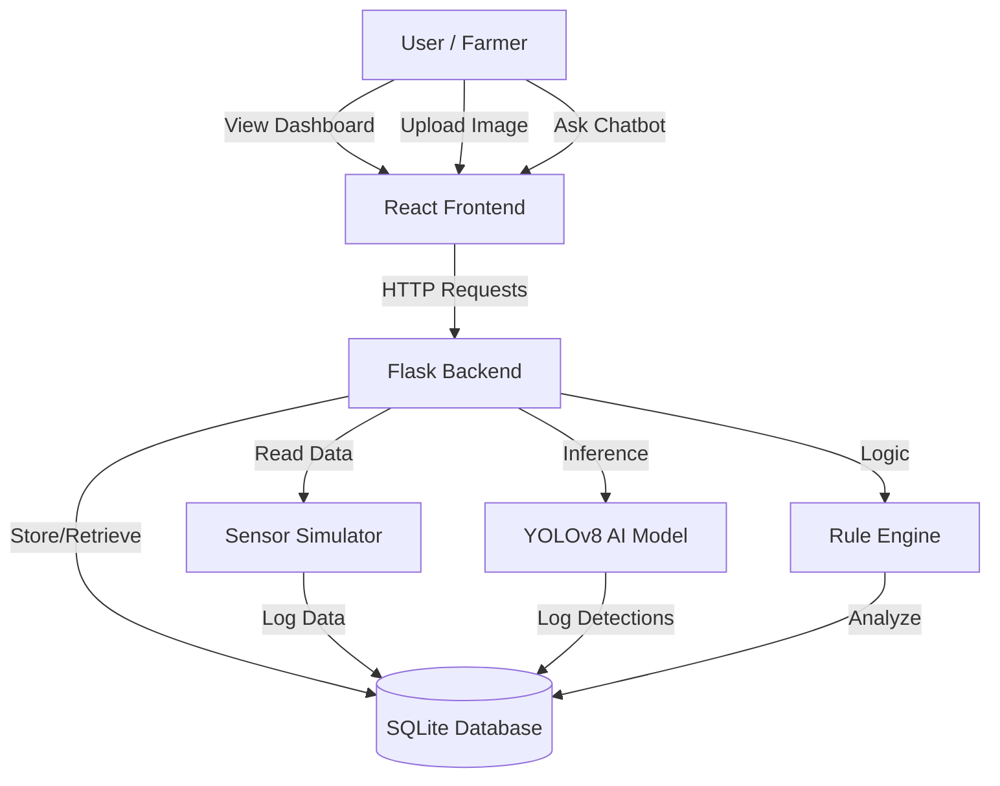

# 🌱 Smart Agriculture Monitoring & AI Chatbot

A comprehensive Agriculture Realtime Monitoring System that combines Computer Vision (YOLOv8), IoT Sensor Simulation, and an AI Chatbot Assistant to help farmers detect diseases and monitor crop health.

---

## 🏗️ System Architecture

The project follows a modular client-server architecture:



### 📂 Key Directories
*   **`backend/`**: Python Flask server, AI models, and logic.
    *   `api/`: Specific logic for Vision, Sensors, and Chatbot.
    *   `services/`: Rule engine and Database helpers.
    *   `models/`: Trained YOLOv8 models (`.pt` files).
*   **`frontend/`**: React.js application.
    *   `src/components/`: Reusable UI components (Dashboard, Chatbot, etc.).

---

## 🚀 Features

### 🖥️ Frontend (React)
1.  **Live Dashboard**: Real-time display of Sensor Data (Temperature, Humidity) and Live Webcam Feed.
2.  **Diagnostic Tool**: Upload photos of crops to instantly detect diseases with confidence scores.
3.  **AI Agri-Advisor Chatbot**: Interactive chat that knows your specific farm status (recent pests, current weather conditions) and gives tailored advice.

### 🧠 Backend (Flask + YOLO)
1.  **Real-time Object Detection**: Processes webcam streams to detect pests and diseases on the fly.
2.  **Context-Aware Logic**: The chatbot doesn't just answer generic questions; it checks the *actual* sensor history and recent detections to give specific warnings.
3.  **Rule Engine**: Automatically flags critical conditions (e.g., "Soil Moisture < 20%" triggers an urgent Irrigation Alert).

---

## 📡 API Documentation

### 1. Vision & Detection
*   **`GET /video_feed`**
    *   Streaming MJPEG response for live video.
*   **`POST /predict-image`**
    *   Upload an image file to get disease predictions.
    *   **Body**: `multipart/form-data` with `file`.
    *   **Response**: `[{ "label": "Tomato Blight", "confidence": 0.85 }, ...]`

### 2. Sensors
*   **`GET /sensors`**
    *   Get current simulated environmental data.
    *   **Response**: `{ "temperature": "26.5°C", "humidity": "65%", ... }`

### 3. Chatbot
*   **`POST /chat`**
    *   Send a message to the AI assistant.
    *   **Body**: `{ "message": "Do I need to water?" }`
    *   **Response**: `{ "response": "Yes, soil moisture is critical (<20%)..." }`

---

## 🛠️ How to Run Locally

### Prerequisites
*   Node.js & npm
*   Python 3.8+
*   Git

### 1. Clone the Repository
```bash
git clone https://github.com/mohamedshaheemkp/Agriculture-Realtime-monitoring-chatbot.git
cd Agriculture-Realtime-monitoring-chatbot
```

### 2. Backend Setup
```bash
cd backend
python -m venv .venv
source .venv/bin/activate  # Windows: .venv\Scripts\activate
pip install -r requirements.txt
python app.py
```
*The server will start at `http://localhost:5050`*

### 3. Frontend Setup
Open a new terminal:
```bash
cd frontend
npm install
npm start
```
*The dashboard will open at `http://localhost:3000`*

---

## 🧪 Testing the System

1.  **Live Monitor**: Open the dashboard to see the webcam feed and sensor values updating every 5 seconds.
2.  **Diagnose**: Go to the "Diagnostic Tool" section, upload a leaf image, and wait for the analysis.
3.  **Ask for Help**: Type "status report" in the Chatbot to get a full summary of your farm's health based on the latest data.


phase 1&2 prompt finished
phase 4.4 prompting not startedxu